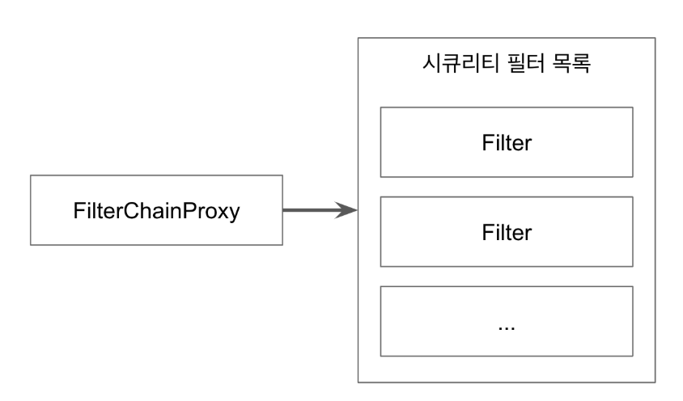
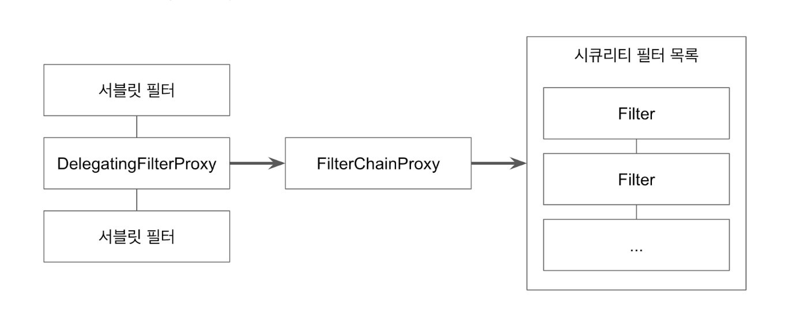
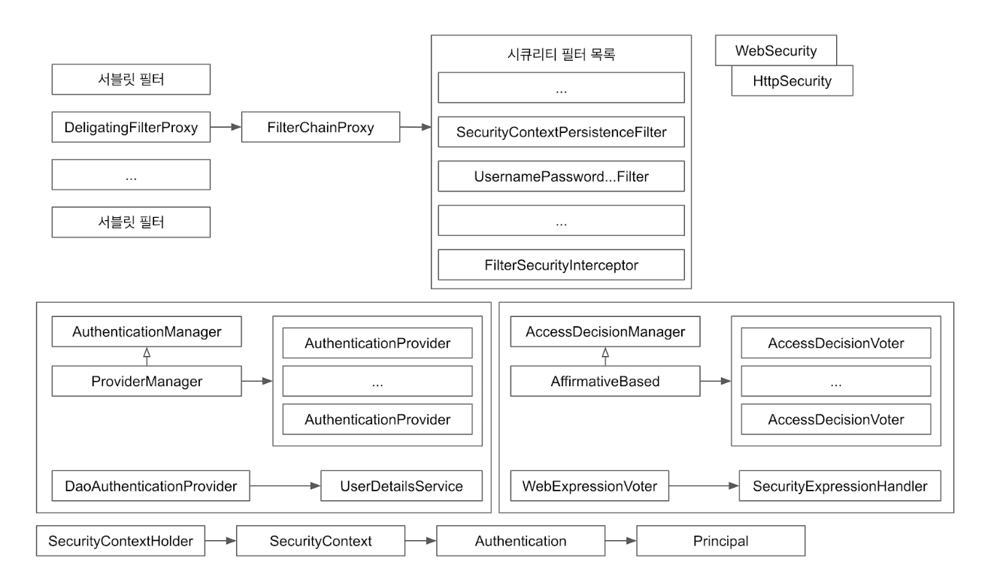

# SpringSecurity

[백기선님]: https://docs.google.com/document/d/19DzeBekximHRXCaeN-UhFewrb9KTo65xj7Rrt9jO_Sk/edit#


spring security 의존성 추가시 모든 요청은 인증을 필요로 한다.

기본유저 생성 - username - user / password - 콘솔에 출력


테스트시

@Transactional

완료 후 롤백 함.


## SecurityContextHolder와 Authentication

##### SecurityContextHolder

- SecurityContext 제공, 기본적으로 ThreadLocal을 사용

  ThreadLocal이란?

  Thread내에서 share하는 저장소

  Methodparameter를 사용하지 않아도 ThreadLocal에 있는 데이터를 접근 할 수 있다.

- SecurityContext

  Autentication제공


##### Autentication

- Principal과 GrantAuthority 제공.

##### Principal

- UserDetails interface의 구현체에서 설정한 user정보가 저장
- “누구"에 해당하는 정보.
-  **UserDetailsService에서 리턴한 그 객체.**
- 객체는 UserDetails 타입.

##### GrantAuthority

- “ROLE_USER”, “ROLE_ADMIN”등 Principal이 가지고 있는 “권한”을 나타낸다.
- 인증 이후, 인가 및 권한 확인할 때 이 정보를 참조한다.

```java
return User.builder()
        .username(account.getUsername())
        .password(account.getPassword())
        .roles(account.getRole())
        .build();
```

##### UserDetails

- 애플리케이션이 가지고 있는 유저 정보와 스프링 시큐리티가 사용하는 Authentication 객체 사이의 어댑터.

##### UserDetailsService

- 유저 정보를 UserDetails 타입으로 가져오는 DAO (Data Access Object) 인터페이스.


## AuthenticationManager와 Authentication

스프링 시큐리티에서 인증(Authentication)은 AuthenticationManager가 한다.

````java
Authentication authenticate(Authentication authentication) throws AuthenticationException;
````

- 인자로 받은 Authentication이 유효한 인증인지 확인하고 Authentication 객체를 리턴한다.

- 인증을 확인하는 과정에서 비활성 계정- DisabledException, 잘못된 비번 - BadCredentialException, 잠긴 계정- LockedException 등의 에러를 던질 수 있다.

  

##### ProviderMananger

DaoAuthenticationProvider.java

getUserDetailsService().loadUserByUsername();

##### 인자로 받은 Authentication

- 사용자가 입력한 인증에 필요한 정보(username, password)로 만든 객체. (폼 인증인 경우)

- Authentication

  ​	Principal: “mkhwang”, Credentials: “123”

##### 유효한 인증인지 확인

- 사용자가 입력한 password가 UserDetailsService를 통해 읽어온 UserDetails 객체에 들어있는 password와 일치하는지 확인

- 해당 사용자 계정이 잠겨 있진 않은지, 비활성 계정은 아닌지 등 확인

  

##### Authentication 객체를 리턴

- Authentication
  - Principal: UserDetailsService에서 리턴한 그 객체 (User)
  - Credentials: GrantedAuthorities


## ThreadLocal

Java.lang 패키지에서 제공하는 쓰레드 범위 변수. 즉, 쓰레드 수준의 데이터 저장소.

- 같은 쓰레드 내에서만 공유.
- 따라서 같은 쓰레드라면 해당 데이터를 메소드 매개변수로 넘겨줄 필요 없음.
- SecurityContextHolder의 기본 전략.

```java
public class AccountContext {

    private static final ThreadLocal<Account> ACCOUNT_THREAD_LOCAL
            = new ThreadLocal<>();

    public static void setAccount(Account account) {
        ACCOUNT_THREAD_LOCAL.set(account);
    }

    public static Account getAccount(){
        return ACCOUNT_THREAD_LOCAL.get();
    }
}
```

SecurityContext에서 사용과 동일


## Authentication과 SecurityContextHolder

AuthenticationManager가 인증을 마친 뒤 리턴 받은 Authentication 객체의 행방은?

매번 인증해야하는가??

UsernamePasswordAuthenticationFilter를 이용히서 폼인증시 시큐리티 처리

SecurityContextPersistenceFilter를 이용해 HTTP session에 캐시하여 여러 요청에 Authentication을 공유하는 필터

##### UsernamePasswordAuthenticationFilter

- 폼 인증을 처리하는 시큐리티 필터

- 인증된 Authentication 객체를 SecurityContextHolder에 넣어주는 필터- 
- SecurityContextHolder.getContext().setAuthentication(authentication) **중요**

  > HttpSessionSecurityContextRepository에서 처리

##### SecurityContextPersistenceFilter

- SecurityContext를 HTTP session에 캐시(기본 전략)하여 여러 요청에서 Authentication을 공유하는 필터.
- SecurityContextRepository를 교체하여 세션을 HTTP session이 아닌 다른 곳에 저장하는 것도 가능하다.

인증이 완료된 Authentication을 AbstractAuthenticationProcessingFilter에서

securityContextHolder에 Authentication저장


세션을 사용하지 않는다면 매 요청마다 다시 인증을 해야 함.


## 스프링 시큐리티 Filter와 FilterChainProxy

스프링 시큐리티가 제공하는 필터들

1. WebAsyncManagerIntergrationFilter
2. **SecurityContextPersistenceFilter**
3. HeaderWriterFilterCsrfFilter
4. CsrfFilter
5. LogoutFilter
6. **UsernamePasswordAuthenticationFilter**
7. DefaultLoginPageGeneratingFilter
8. DefaultLogoutPageGeneratingFilter
9. BasicAuthenticationFilter
10. RequestCacheAwareFtiler
11. SecurityContextHolderAwareReqeustFilter
12. AnonymouseAuthenticationFilter
13. SessionManagementFilter
14. ExeptionTranslationFilterFilter
15. FilterSecurityInterceptor

이 모든 필터는 **FilterChainProxy**가 호출한다.

FilterChainProxy getFilters




## DelegatingFilterProxy와 FilterChainProxy

##### DelegatingFilterProxy

- 일반적인 서블릿 필터.

- 서블릿 필터 처리를 스프링에 들어있는 빈으로 위임하고 싶을 때 사용하는 서블릿 필터.

- 타겟 빈 이름을 설정한다.

- 스프링 부트 없이 스프링 시큐리티 설정할 때는 AbstractSecurityWebApplicationInitializer를 사용해서 등록.

- 스프링 부트를 사용할 때는 자동으로 등록 된다. (SecurityFilterAutoConfiguration)

  

##### FilterChainProxy

- 보통 “springSecurityFilterChain” 이라는 이름의 빈으로 등록된다.



## AccessDecisionManager 1부

리소스에 접근하려고할때 그것을 허용할 것인가 그 것이 유효한 요청인가를 판단하는.

인가 할때는AccessDecisionManager

인증 할때는 AuthenticationManager

##### Access Control 결정을 내리는 인터페이스로, 구현체 3가지를 기본으로 제공한다.

- **AffirmativeBased**: 여러 Voter중에 한명이라도 허용하면 허용. 기본 전략.
- ConsensusBased: 다수결
- UnanimousBased: 만장일치

##### AccessDecisionVoter

- 해당 Authentication이 특정한 Object에 접근할 때 필요한 ConfigAttributes를 만족하는지 확인한다.
- **WebExpressionVoter**: 웹 시큐리티에서 사용하는 기본 구현체, ROLE_Xxxx가 매치하는지 확인.
- RoleHierarchyVoter: 계층형 ROLE 지원. ADMIN > MANAGER > USER...

## AccessDecisionManager 2부

AccessDicisionManager 또는 Voter를 커스터마이징 하는 방법

RoleHierarchy를 이용하여 admin은 user권한도 함께 가질 수 있도록 구현

```java
public SecurityExpressionHandler expressionHandler() {
    RoleHierarchyImpl roleHierarchy = new RoleHierarchyImpl();
    roleHierarchy.setHierarchy("ROLE_ADMIN > ROLE_USER");

    DefaultWebSecurityExpressionHandler handler = new DefaultWebSecurityExpressionHandler();
    handler.setRoleHierarchy(roleHierarchy);

    return handler;
}

@Override
public void configure(HttpSecurity http) throws Exception {
    http
      .antMatcher("/**")
      .authorizeRequests()
      .mvcMatchers("/","/info","/account/**").permitAll()
      .mvcMatchers("/admin").hasRole("ADMIN")
      .mvcMatchers("/user").hasRole("USER")
      .anyRequest().authenticated()
      .expressionHandler(expressionHandler());
    http.formLogin();
    http.httpBasic();
}
```


## FilterSecurityInterceptor

AccessDicisionManager를 사용하며 Access Control또는 예외 처리 하는 필터.

대부분의 경우 FilterChainProxy에 제일 마지막 필터로 들어있다.


종합

SecurityContextHolder가 Authentication을 가지고 있고,

Authentication은 AuthenticationManager를 통해 인증하고, 결과로 나온 Authentication을 다시 SecurityContextHolder에 넣어 주는 역할 - UsernamePasswordAuthenticationFilter, SecurityContextPersistenceFilter

이러한 필터들은 FilterChainProxy에 의해 순차적으로 실행해주고

FilterChainProxy도 DelegatingFilterProxy를 통해서 요청을 전달받은거고, DelegatingFilterProxy는 스프링 부트를 사용할 때는 자동으로 등록 됨. SecurityFilterAutoConfiguration

부트를 쓰지 않을 때에는 AbstractSecurityWebApplicationInitializer를 상속받아서 쓰면 된다.

인가 - AccessDecisionManager 내부적으로는 AccessDicisionVoter를 여러개 쓰고있고,

AccessDecisionManager는 FilterSecurityInterceptor가 사용하는데 FilterChainProxy의 필터중 하나.


## ExceptionTranslationFilter

필터 체인에서 발생하는 AccessDeniedException과 AuthenticationException을 처리하는 필터(예외 처리기)

##### AuthenticationException 발생 시 - 인증 예외

- AuthenticationEntryPoint 실행 - 인증처리기

- AbstractSecurityInterceptor 하위 클래스(예, FilterSecurityInterceptor)에서 발생하는 예외만 처리.

- 그렇다면 UsernamePasswordAuthenticationFilter에서 발생한 인증 에러는?

  ExceptionTranslationFilter가 처리하지 않는다. UsernamePasswordAuthenticationFilter에서 처리

  

##### AccessDeniedException 발생 시

- 익명 사용자라면 AuthenticationEntryPoint 실행
- 익명 사용자가 아니면 AccessDeniedHandler에게 위임


## SpringSecurity 아키텍쳐 정리

```java
* The {@link WebSecurity} is created by {@link WebSecurityConfiguration} to create the
* {@link FilterChainProxy} known as the Spring Security Filter Chain
* (springSecurityFilterChain). The springSecurityFilterChain is the {@link Filter} that
* the {@link DelegatingFilterProxy} delegates to.
```




## 스프링 시큐리티 ignoring() 1부

WebSecurity의 ignoring()을 사용해서 시큐리티 필터 적용을 제외할 요청을 설정할 수 있다.

@Overridepublic void configure(WebSecurity web) throws Exception {    web.ignoring().requestMatchers(PathRequest.toStaticResources().atCommonLocations());}

스프링 부트가 제공하는 PathRequest를 사용해서 정적 자원 요청을 스프링 시큐리티 필터를 적용하지 않도록 설정.


## 스프링 시큐리티 ignoring() 2부

```java
http.authorizeRequests().requestMatchers(PathRequest.toStaticResources().atCommonLocations()).permitAll()
```

이런 설정으로도 같은 결과를 볼 수는 있지만 스프링 시큐리티 필터가 적용된다는 차이가 있다.

- 동적 리소스는 http.authorizeRequests()에서 처리하는 것을 권장합니다.
- 정적 리소스는 WebSecurity.ignore()를 권장하며 예외적인 정적 자원 (인증이 필요한 정적자원이 있는 경우)는 http.authorizeRequests()를 사용할 수 있습니다.


## Async 웹 MVC를 지원하는 필터: WebAsyncManagerIntegrationFilter

스프링 MVC의 Async 기능(핸들러에서 Callable을 리턴할 수 있는 기능)을 사용할 때에도 SecurityContext를 공유하도록 도와주는 필터.

- PreProcess: SecurityContext를 설정한다.
- Callable: 비록 다른 쓰레드지만 그 안에서는 동일한 SecurityContext를 참조할 수 있다.
- PostProcess: SecurityContext를 정리(clean up)한다.


## 스프링 시큐리티와 @Async

@Async를 사용한 서비스를 호출하는 경우

- 쓰레드가 다르기 때문에 SecurityContext를 공유받지 못한다.

```java
SecurityContextHolder.setStrategyName(SecurityContextHolder.MODE_INHERITABLETHREADLOCAL);
```

- SecurityContext를 자식 쓰레드에도 공유하는 전략.
- @Async를 처리하는 쓰레드에서도 SecurityContext를 공유받을 수 있다.
- 참고 https://docs.oracle.com/javase/7/docs/api/java/lang/InheritableThreadLocal.html


## SecurityContext 영속화 필터: SecurityContextPersistenceFilter

SecurityContextRepository를 사용해서 기존의 SecurityContext를 읽어오거나 초기화 한다.

- 기본으로 사용하는 전략은 HTTP Session을 사용한다.
- [Spring-Session](https://spring.io/projects/spring-session#learn)과 연동하여 세션 클러스터를 구현할 수 있다. 


## 시큐리티 관련 헤더 추가하는 필터: HeaderWriterFilter

##### 응답 헤더에 시큐리티 관련 헤더를 추가해주는 필터

- XContentTypeOptionsHeaderWriter: 마임 타입 스니핑 방어.
- XXssProtectionHeaderWriter: 브라우저에 내장된 XSS 필터 적용.
- CacheControlHeadersWriter: 캐시 히스토리 취약점 방어.
- HstsHeaderWriter: HTTPS로만 소통하도록 강제.
- XFrameOptionsHeaderWriter: clickjacking 방어.

Cache-Control: no-cache, no-store, max-age=0, must-revalidate

Content-Language: en-US

Content-Type: text/html;

charset=UTF-8Date: Sun, 04 Aug 2019 16:25:10 GMT

Expires: 0Pragma: no-cache

Transfer-Encoding: chunked

X-Content-Type-Options: nosniff

X-Frame-Options: DENY

X-XSS-Protection: 1; mode=block

참고

- X-Content-Type-Options:https://developer.mozilla.org/en-US/docs/Web/HTTP/Headers/X-Content-Type-Options
- Cache-Control:https://www.owasp.org/index.php/Testing_for_Browser_cache_weakness_(OTG-AUTHN-006)
- X-XSS-Protection:https://developer.mozilla.org/en-US/docs/Web/HTTP/Headers/X-XSS-Protectionhttps://github.com/naver/lucy-xss-filter
- HSTS:https://cheatsheetseries.owasp.org/cheatsheets/HTTP_Strict_Transport_Security_Cheat_Sheet.html
- X-Frame-Options


## CSRF 어택 방지 필터: CsrfFilterCSRF 

어택 방지 필터 

원치않는 요청을 만들어서 보내는 것

- 인증된 유저의 계정을 사용해 악의적인 변경 요청을 만들어 보내는 기법.
- https://www.owasp.org/index.php/Cross-Site_Request_Forgery_(CSRF)
- https://namu.wiki/w/CSRF
- CORS를 사용할 때 특히 주의 해야 함.
  - 타 도메인에서 보내오는 요청을 허용하기 때문에...
  - https://en.wikipedia.org/wiki/Cross-origin_resource_sharing

요청시 CsrfFilter에서 form으로 input hidden으로 토큰 값을 보냄 로그인페이지로

로그인시 전송된 토큰과 비교하여 정상요청인지 확인.


## CSRF 토큰 사용 예제

JSP에서 스프링 MVC가 제공하는 <form:form> 태그 또는 타임리프 2.1+ 버전을 사용할 때 폼에 CRSF 히든 필드가 기본으로 생성 됨.


## 로그아웃 처리 필터: LogoutFilter

여러 LogoutHandler를 사용하여 로그아웃시 필요한 처리를 하며 이후에는 LogoutSuccessHandler를 사용하여 로그아웃 후처리를 한다.

LogoutHandler

- CsrfLogoutHandler
- SecurityContextLogoutHandler

LogoutSuccessHandler

- SimplUrlLogoutSuccessHandler

로그아웃 필터 설정

